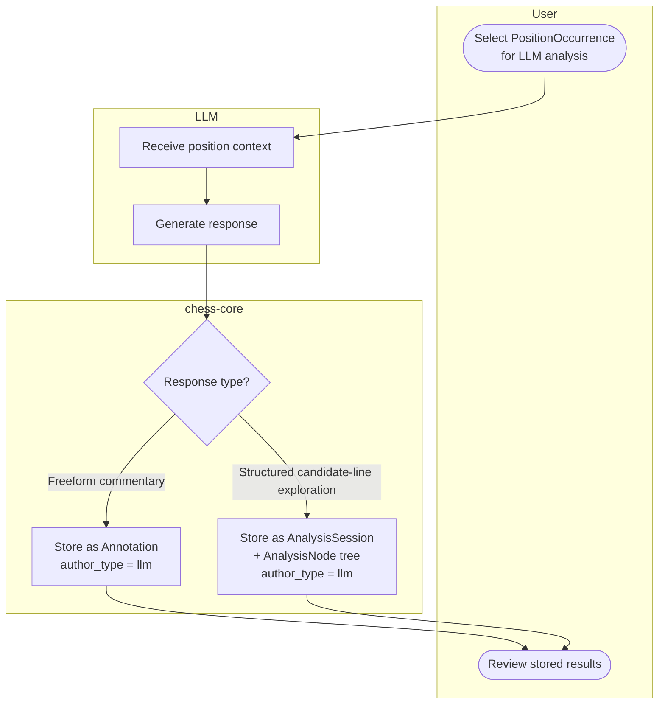
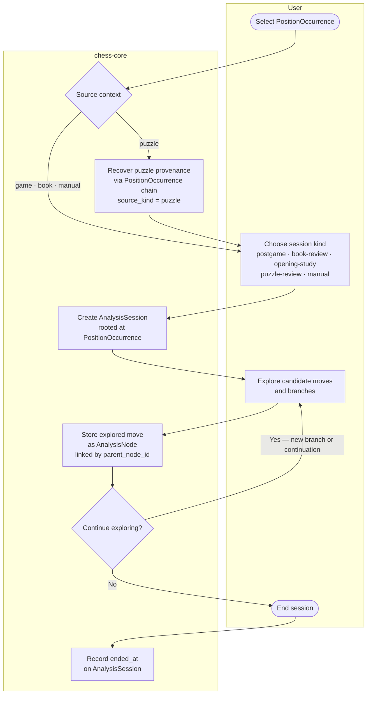

# Analysis Flows

## LLM Output Ingestion

```mermaid
flowchart TD
    subgraph User
        A([Select PositionOccurrence\nfor LLM analysis])
        G([Review stored results])
    end
    subgraph LLM
        B[Receive position context]
        C[Generate response]
    end
    subgraph chess-core
        D{Response type?}
        E[Store as Annotation\nauthor_type = llm]
        F[Store as AnalysisSession\n+ AnalysisNode tree\nauthor_type = llm]
    end

    A --> B --> C --> D
    D -->|Freeform commentary| E --> G
    D -->|Structured candidate-line exploration| F --> G
```

---

## Analysis Session Creation

```mermaid
flowchart TD
    subgraph User
        A([Select PositionOccurrence])
        C[Choose session kind\npostgame · book-review · opening-study\npuzzle-review · manual]
        F[Explore candidate moves\nand branches]
        I([End session])
    end
    subgraph chess-core
        B{Source context}
        D[Recover puzzle provenance\nvia PositionOccurrence chain\nsource_kind = puzzle]
        E[Create AnalysisSession\nrooted at PositionOccurrence]
        G[Store explored move\nas AnalysisNode\nlinked by parent_node_id]
        H{Continue exploring?}
        J[Record ended_at\non AnalysisSession]
    end

    A --> B
    B -->|game · book · manual| C
    B -->|puzzle| D --> C
    C --> E --> F --> G --> H
    H -->|Yes — new branch or continuation| F
    H -->|No| I --> J
```
