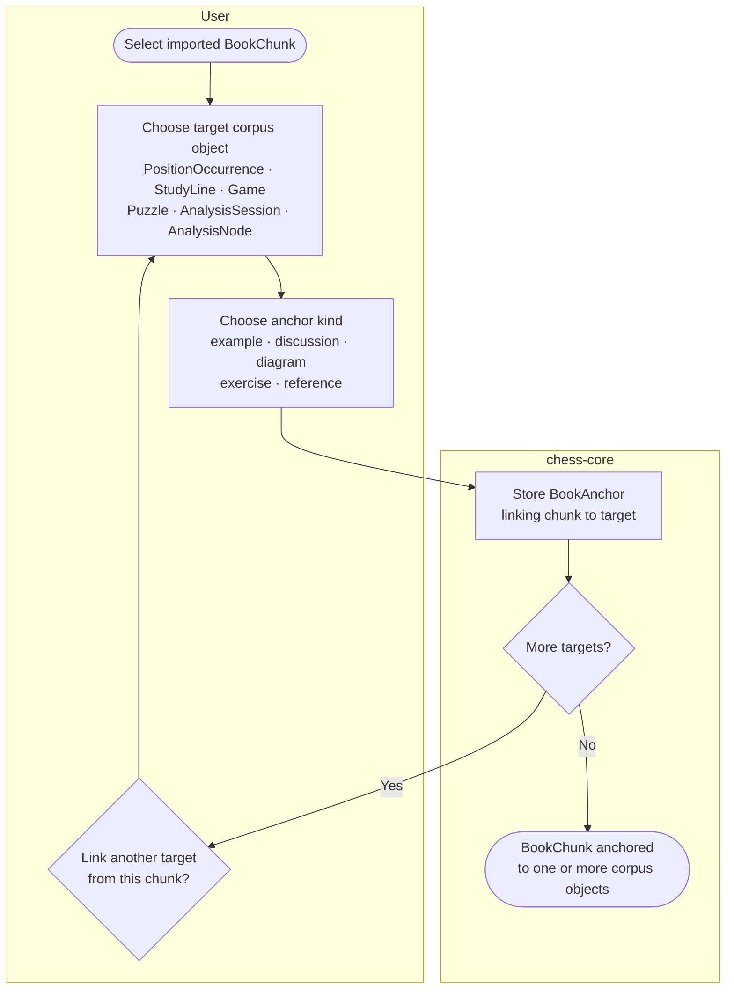
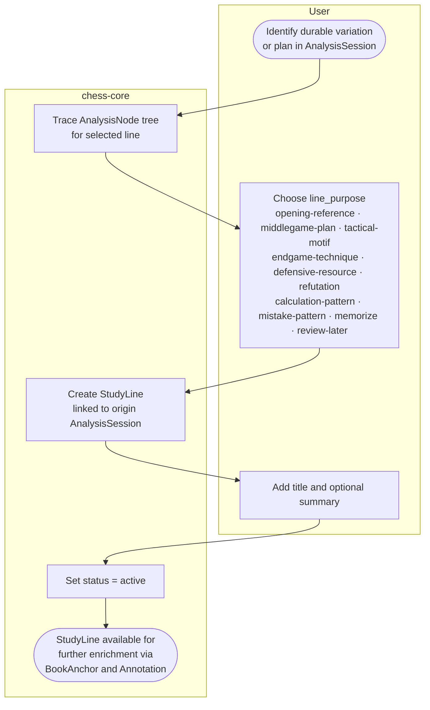

# Enrichment Flows

## Book-Anchoring Workflow

```mermaid
flowchart TD
    subgraph User
        A([Select imported BookChunk])
        B[Choose target corpus object\nPositionOccurrence · StudyLine · Game\nPuzzle · AnalysisSession · AnalysisNode]
        C[Choose anchor kind\nexample · discussion · diagram\nexercise · reference]
        F{Link another target\nfrom this chunk?}
    end
    subgraph chess-core
        D[Store BookAnchor\nlinking chunk to target]
        E{More targets?}
        G([BookChunk anchored\nto one or more corpus objects])
    end

    A --> B --> C --> D --> E
    E -->|Yes| F --> B
    E -->|No| G
```

---

## Study Line Promotion

```mermaid
flowchart TD
    subgraph User
        A([Identify durable variation\nor plan in AnalysisSession])
        C[Choose line_purpose\nopening-reference · middlegame-plan · tactical-motif\nendgame-technique · defensive-resource · refutation\ncalculation-pattern · mistake-pattern · memorize · review-later]
        E[Add title and optional summary]
    end
    subgraph chess-core
        B[Trace AnalysisNode tree\nfor selected line]
        D[Create StudyLine\nlinked to origin AnalysisSession]
        F[Set status = active]
        G([StudyLine available for\nfurther enrichment via\nBookAnchor and Annotation])
    end

    A --> B --> C --> D --> E --> F --> G
```
