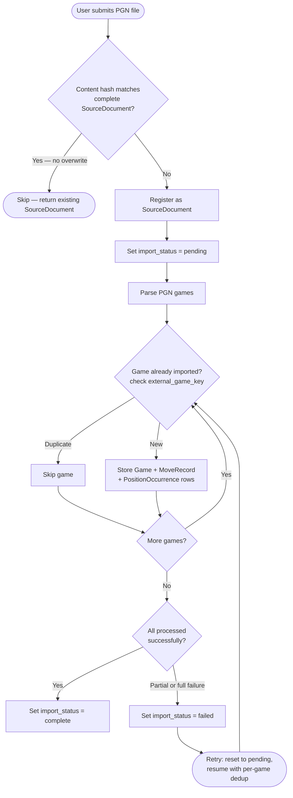
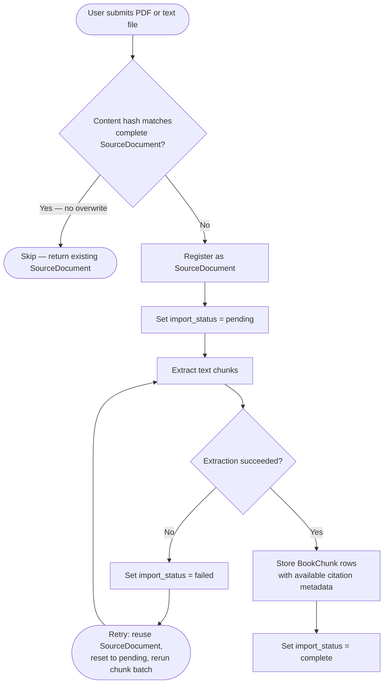
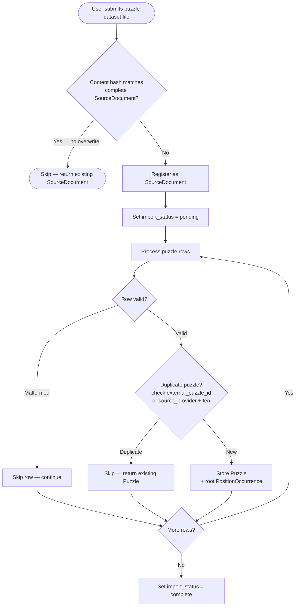
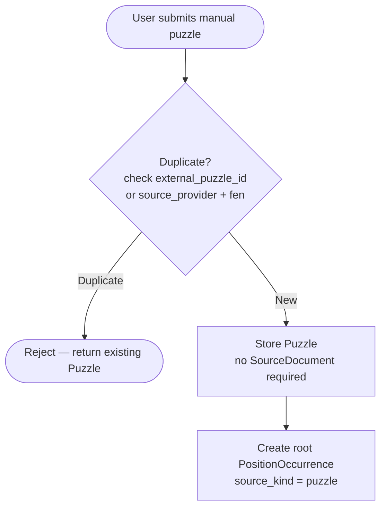

# Ingestion Flows

## PGN File Ingestion

```mermaid
flowchart TD
    A([User submits PGN file]) --> B{Content hash matches\ncomplete SourceDocument?}
    B -->|Yes — no overwrite| C([Skip — return existing SourceDocument])
    B -->|No| D[Register as SourceDocument]
    D --> E[Set import_status = pending]
    E --> F[Parse PGN games]
    F --> G{Game already imported?\ncheck external_game_key}
    G -->|Duplicate| H[Skip game]
    G -->|New| I[Store Game + MoveRecord\n+ PositionOccurrence rows]
    H --> J{More games?}
    I --> J
    J -->|Yes| G
    J -->|No| K{All processed\nsuccessfully?}
    K -->|Yes| L[Set import_status = complete]
    K -->|Partial or full failure| M[Set import_status = failed]
    M --> N([Retry: reset to pending,\nresume with per-game dedup])
    N --> G
```

---

## Book / Document Ingestion

```mermaid
flowchart TD
    A([User submits PDF or text file]) --> B{Content hash matches\ncomplete SourceDocument?}
    B -->|Yes — no overwrite| C([Skip — return existing SourceDocument])
    B -->|No| D[Register as SourceDocument]
    D --> E[Set import_status = pending]
    E --> F[Extract text chunks]
    F --> G{Extraction succeeded?}
    G -->|No| H[Set import_status = failed]
    H --> I([Retry: reuse SourceDocument,\nreset to pending, rerun chunk batch])
    I --> F
    G -->|Yes| J[Store BookChunk rows\nwith available citation metadata]
    J --> K[Set import_status = complete]
```

---

## Puzzle Dataset Ingestion

```mermaid
flowchart TD
    A([User submits puzzle dataset file]) --> B{Content hash matches\ncomplete SourceDocument?}
    B -->|Yes — no overwrite| C([Skip — return existing SourceDocument])
    B -->|No| D[Register as SourceDocument]
    D --> E[Set import_status = pending]
    E --> F[Process puzzle rows]
    F --> G{Row valid?}
    G -->|Malformed| H[Skip row — continue]
    G -->|Valid| I{Duplicate puzzle?\ncheck external_puzzle_id\nor source_provider + fen}
    I -->|Duplicate| J[Skip — return existing Puzzle]
    I -->|New| K[Store Puzzle\n+ root PositionOccurrence]
    H --> L{More rows?}
    J --> L
    K --> L
    L -->|Yes| F
    L -->|No| M[Set import_status = complete]
```

---

## Manual Puzzle Creation

```mermaid
flowchart TD
    A([User submits manual puzzle]) --> B{Duplicate?\ncheck external_puzzle_id\nor source_provider + fen}
    B -->|Duplicate| C([Reject — return existing Puzzle])
    B -->|New| D[Store Puzzle\nno SourceDocument required]
    D --> E[Create root PositionOccurrence\nsource_kind = puzzle]
```
