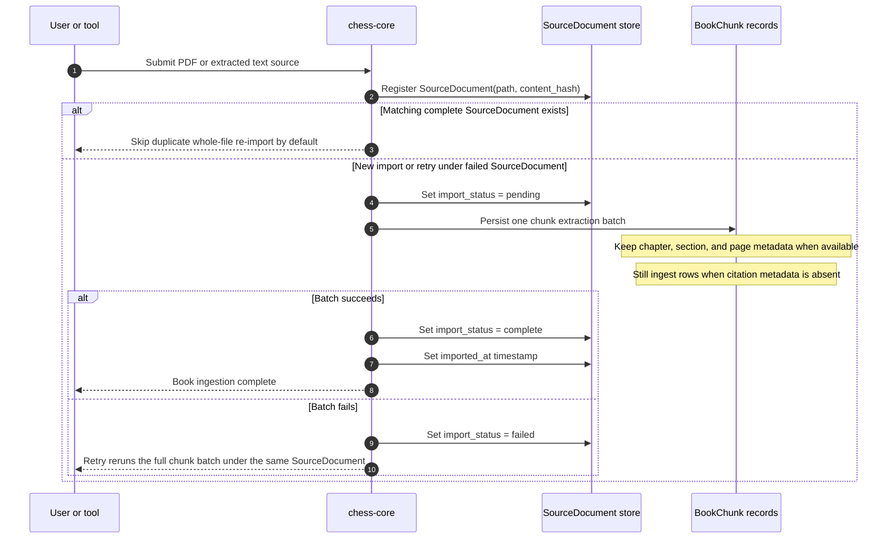
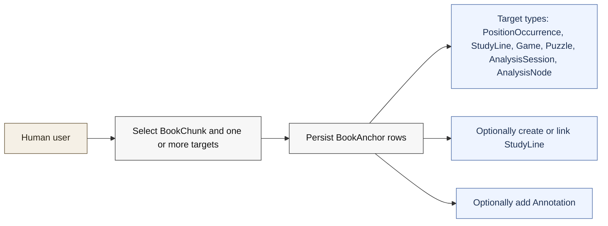

# V1 Book Ingestion And Linking

Backed by:
- [docs/llds/storage-and-ingestion.md](/Users/trevorwulke/workspace/chess-core/docs/llds/storage-and-ingestion.md)
- [docs/llds/canonical-corpus-model.md](/Users/trevorwulke/workspace/chess-core/docs/llds/canonical-corpus-model.md)
- Specs: `ING-015` through `ING-020`, `CRP-034` through `CRP-037`

## Book Or Document Ingestion

## Manual Linking Swim Lane

## Reading Notes
- Import and linking are intentionally separate stages.
- `BookChunk` preserves source text; `BookAnchor` adds chess meaning without
  mutating the chunk itself.
- v1 excludes `move_record` as a direct `BookAnchor` target type.
