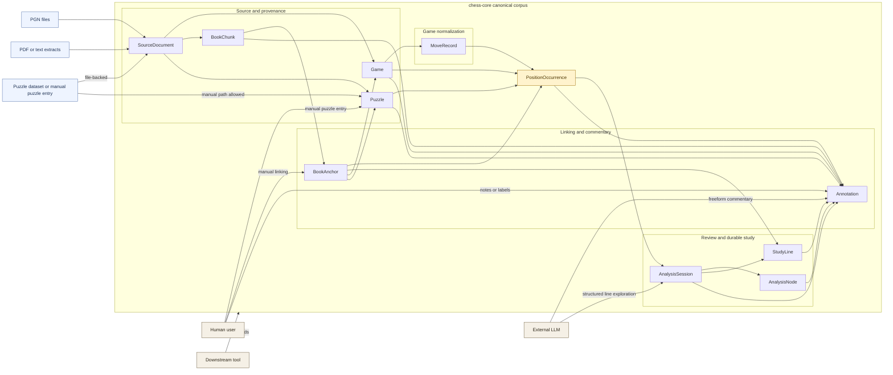

# V1 Corpus Overview

Backed by:
- [docs/high-level-design.md](/Users/trevorwulke/workspace/chess-core/docs/high-level-design.md)
- [docs/llds/canonical-corpus-model.md](/Users/trevorwulke/workspace/chess-core/docs/llds/canonical-corpus-model.md)
- [docs/llds/storage-and-ingestion.md](/Users/trevorwulke/workspace/chess-core/docs/llds/storage-and-ingestion.md)
- Specs: `CRP-001` through `CRP-049`, `ING-001` through `ING-023`, `PZL-001` through `PZL-017`

This overview is lifecycle-first, but it keeps `PositionOccurrence` at the center
because v1 study meaning converges there regardless of source family.

## Reading Notes
- `SourceDocument` exists for file-backed provenance, but manual puzzle entry may
  create `Puzzle` without it.
- `PositionOccurrence` is the center of study context, not merely a computed side
  table for moves.
- Post-ingestion enrichment writes into `BookAnchor`, `Annotation`,
  `AnalysisSession`, `AnalysisNode`, and optionally `StudyLine`.
