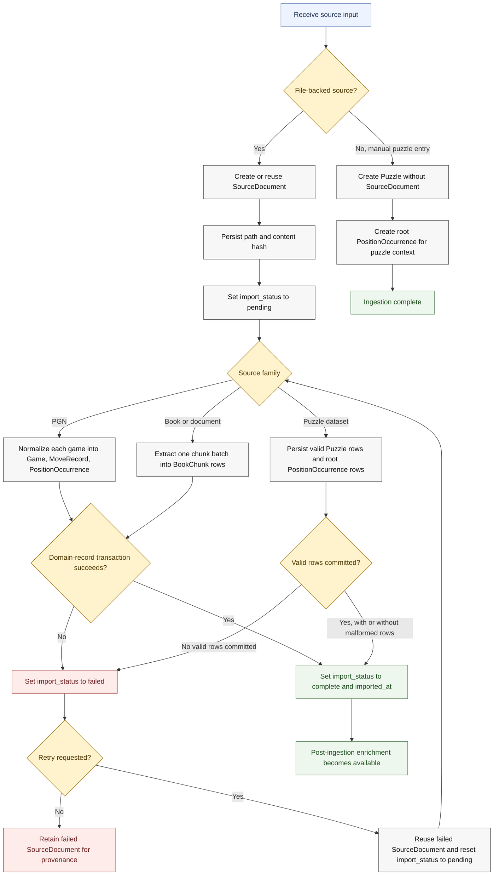

# V1 Ingestion Overview

Backed by:
- [docs/llds/storage-and-ingestion.md](/Users/trevorwulke/workspace/chess-core/docs/llds/storage-and-ingestion.md)
- [docs/llds/canonical-corpus-model.md](/Users/trevorwulke/workspace/chess-core/docs/llds/canonical-corpus-model.md)
- Specs: `ING-001` through `ING-023`, `PZL-001` through `PZL-012`

This diagram shows the shared lifecycle shape across v1 source families. Detailed
per-source semantics are split into the focused workflow docs.

## Reading Notes
- File-backed ingestion uses the staged-commit model: `SourceDocument` first, then
  domain records.
- PGN and book/document retries reuse the failed `SourceDocument`.
- Puzzle dataset ingestion may keep valid rows even when some rows are malformed.
