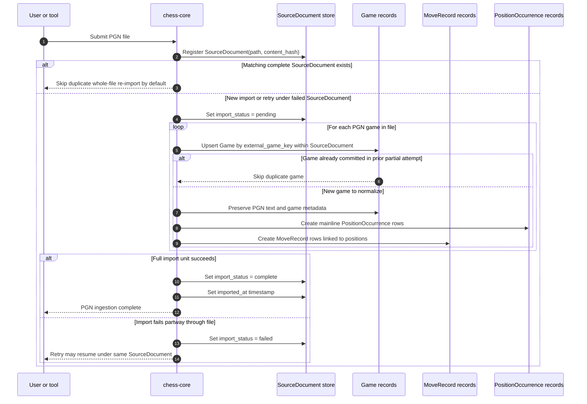

# V1 PGN Ingestion

Backed by:
- [docs/llds/storage-and-ingestion.md](/Users/trevorwulke/workspace/chess-core/docs/llds/storage-and-ingestion.md)
- [docs/llds/canonical-corpus-model.md](/Users/trevorwulke/workspace/chess-core/docs/llds/canonical-corpus-model.md)
- Specs: `ING-008` through `ING-014`, `CRP-012` through `CRP-023`, `CRP-047` through `CRP-049`

## Reading Notes
- The retry path is file-scoped for provenance but game-scoped for deduplication.
- v1 PGN ingestion creates mainline `PositionOccurrence` rows only.
- `MoveRecord` links games to positions in both sequence and provenance terms.
