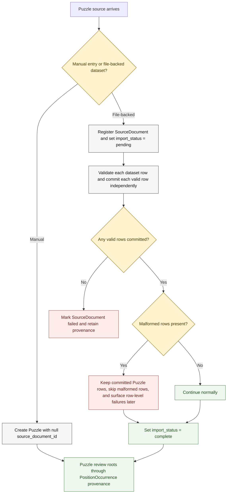
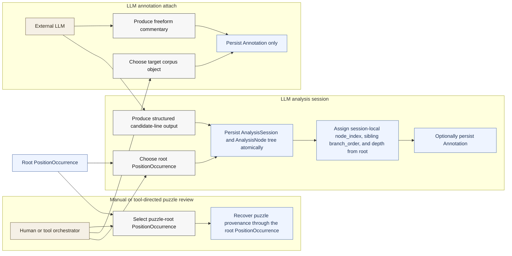

# V1 Puzzle And Analysis Flows

Backed by:
- [docs/llds/storage-and-ingestion.md](/Users/trevorwulke/workspace/chess-core/docs/llds/storage-and-ingestion.md)
- [docs/llds/canonical-corpus-model.md](/Users/trevorwulke/workspace/chess-core/docs/llds/canonical-corpus-model.md)
- Specs: `PZL-001` through `PZL-017`, `ING-021` through `ING-023`, `CRP-024` through `CRP-046`

## Puzzle Intake And Review Context

## Post-Ingestion Enrichment Swim Lanes

## Reading Notes
- Puzzle provenance for review flows through the root `PositionOccurrence`, not a
  direct `puzzle_id` on `AnalysisSession`.
- Analysis-tree persistence is atomic per capture submission; failed node
  validation must not leave behind a partial session tree.
- `AnalysisNode.node_index` is a caller-supplied stable session-local
  identifier, `branch_order` is sibling-local display order, and `ply_depth`
  counts plies from the root `PositionOccurrence`.
- File-backed puzzle datasets commit valid rows independently and reuse the same
  failed `SourceDocument` on retry, skipping already committed puzzles using
  `external_puzzle_id` when present or (`source_provider`, `fen`) otherwise.
- Freeform LLM output stays in `Annotation`.
- Structured line exploration becomes first-class `AnalysisSession` and
  `AnalysisNode` data.
