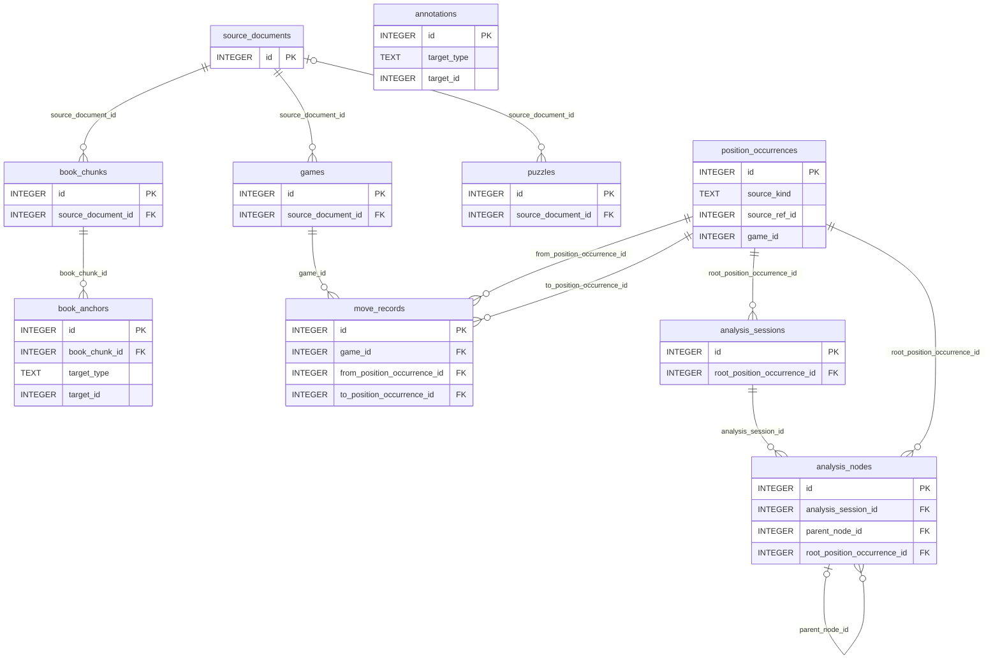

# V1 Schema FK ERD

Backed by:
- [docs/high-level-design.md](/Users/trevorwulke/workspace/chess-core/docs/high-level-design.md)
- [docs/llds/canonical-corpus-model.md](/Users/trevorwulke/workspace/chess-core/docs/llds/canonical-corpus-model.md)
- [docs/specs/corpus-model-specs.md](/Users/trevorwulke/workspace/chess-core/docs/specs/corpus-model-specs.md)
- [schema/sqlite/schema.sql](/Users/trevorwulke/workspace/chess-core/schema/sqlite/schema.sql)
- Specs: `CRP-004` through `CRP-050`

This ERD is a consumer-facing reference for the currently implemented v1 `sqlite`
schema. It shows the 10 concrete corpus tables and the declared foreign-key
relationships between them. Runtime-resolved polymorphic targets are called out
below the diagram instead of being drawn as native Mermaid FK edges.

## Reading Notes
- `position_occurrences.source_ref_id` is polymorphic by `source_kind`, so it is
  runtime-validated against `games`, `book_chunks`, or `puzzles` rather than
  declared as one SQL foreign key.
- `position_occurrences.game_id` is a join-friendly game-context helper in the
  current schema, but it is validated by trigger logic rather than declared as a
  native SQL foreign key, so it is not drawn as a Mermaid FK edge.
- `book_anchors.target_type` and `book_anchors.target_id` are polymorphic. In
  the current v1 schema, only `book_chunk_id` is a declared SQL foreign key, so
  the target-side links are documented in prose rather than drawn as Mermaid FK
  edges.
- `annotations.target_type` and `annotations.target_id` are also polymorphic and
  runtime-validated, so `annotations` appears as an entity without native
  Mermaid FK edges.
- `StudyLine` remains part of the approved design chain, but it is not one of
  the 10 currently implemented corpus tables in `schema/sqlite/schema.sql`, so
  it is intentionally outside this implemented-schema ERD.
